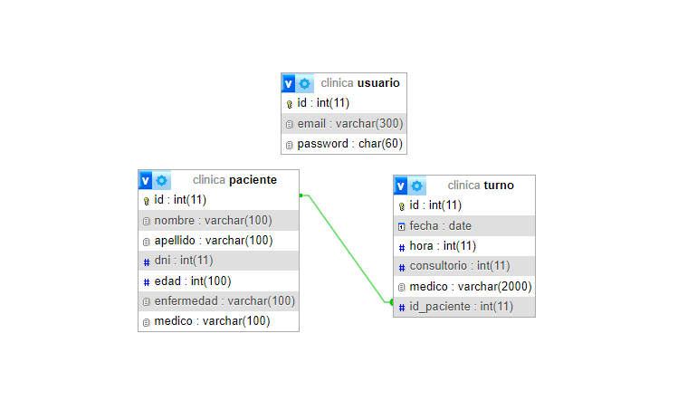

# la-clinica-web2-tudai

## Integrantes:
* Jazmín Barragán.
* Agustin Ciantini.

## Descripción:

Nuestra web tratará sobre un turnero de una clínica médica, que contará en su base de datos con dos tablas (turno y paciente) con una relación entre sí, mediante el id de ambos. Se podrán observar los turnos ya otorgados a su respectivo paciente junto a su médico asignado, además nuestra web permite gestionarlos (agregar, eliminar y editar).

# Guía para cargar database:

Para cargar nuestro sitio en un servidor con Apache o MySQL, primero, deberas cargar nuestra base de datos "clinica" en MySQL. Podes hacer esto importando el archivo .SQL a través de la interfaz de phpMyAdmin o mediante el comando mysql en la terminal.

Una vez que la base de datos esté cargada en phpMyAdmin, coloca los archivos en la carpeta "htdocs" de tú Xampp y ingresa en la barra del navegador la siguiente url "http://localhost/clinica/la-clinica-web2-tudai/home".

## ¿Cómo inicio sesión?
Para poder iniciar sesión en nuestra página web, se necesitan las credenciales. Estos son los datos:

* Usuario: webadmin
* Contraseña: admin

## DER:

